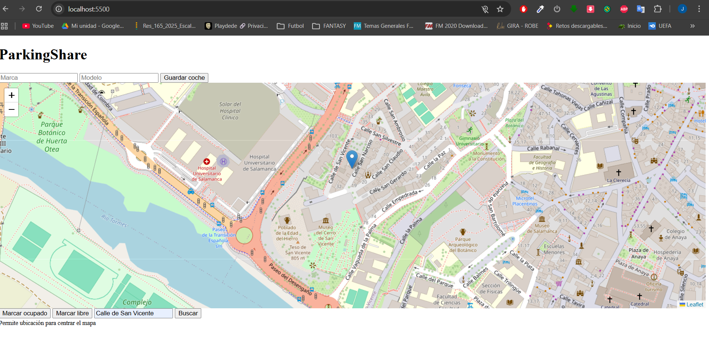

# ParkingShare — Versión 1  
Sistema básico para gestionar y visualizar plazas de aparcamiento en tiempo real.

Incluye:
- API REST con FastAPI  
- WebSockets para actualizaciones en vivo  
- Base de datos SQLite  
- Frontend simple (HTML + CSS + JS)  
- Compatibilidad total con Python 3.13 (Pydantic v2 + SQLModel 0.0.16)

---

## Tecnologías utilizadas

### Backend
- FastAPI >= 0.110  
- SQLModel >= 0.0.16  
- Pydantic >= 2.6  
- Hypercorn  
- SQLite  

### Frontend
- HTML  
- CSS  
- JavaScript (fetch + WebSocket)

---

## Requisitos previos

- **Python 3.13**  
- Git instalado  
- Navegador web moderno

---

## Estructura del proyecto

```
PROYECTOV1/
│
├── backend/
│   ├── main.py
│   ├── models.py
│   ├── requirements.txt
│   ├── spots.db   (opcional)
│
├── fronted/
│   ├── index.html
│   ├── style.css
│   ├── app.js
│
├── .gitignore
└── README.md
```


---

##  Instalación del backend

### 1.-Crear entorno virtual

```
cd C:\Proyectov1\backend> 
```

```
python -m venv venv
```

### 2.-Activar entorno virtual 

### En C:\Proyectov1\backend>
```
.\venv\Scripts\Activate.ps1

``` 
### 3.-Instalar dependencias

### Desde (venv) C:\Proyectov1\backend>

``` 
pip install -r requirements.txt

``` 

### 4.-Activar Backend

### Desde (venv) C:\Proyectov1\backend>

``` 
hypercorn main:app --reload

``` 


### 5.-Ejecutar el frontend
### Desde la carpeta raíz del proyecto:

```
PS C:\proyecto> cd .\fronted\
PS C:\proyecto\fronted> python -m http.server 5500

```

### Ya puedes acceder a la aplicación

